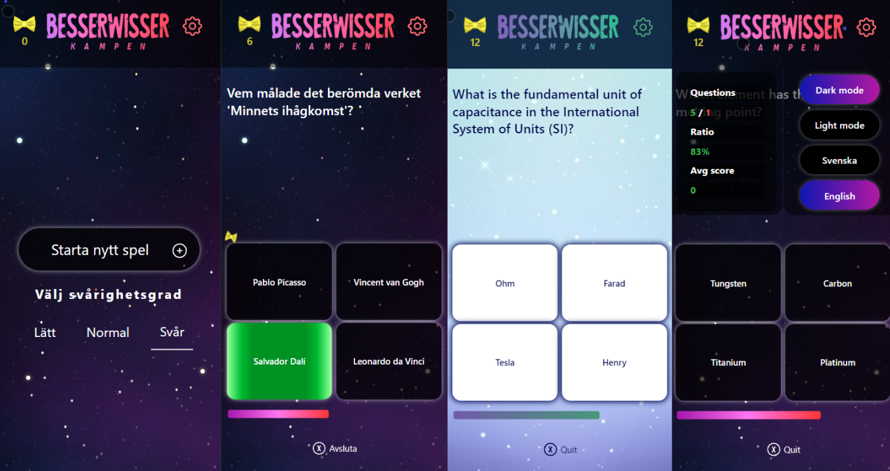

# JavaScript Quiz App

## Project Overview
This repository contains a quiz app implemented in vanilla JavaScript. The app offers three difficulty levels, supports text in both English and Swedish, features dark mode and light mode, and utilizes local storage for score and score statistics.

## Features
### Difficulty Levels:
Offers three different difficulty levels to cater to a diverse audience.

### Multilingual Support:
Provides support for quiz content in both English and Swedish.

### Dark Mode and Light Mode:
Implements a user-friendly interface with options for both dark and light modes.

### Local Storage Integration:
Stores and retrieves user scores and score statistics using local storage.

### Technologies Used
JavaScript: Core language for app functionality.

HTML/SASS: Basic structure and styling of the app.
